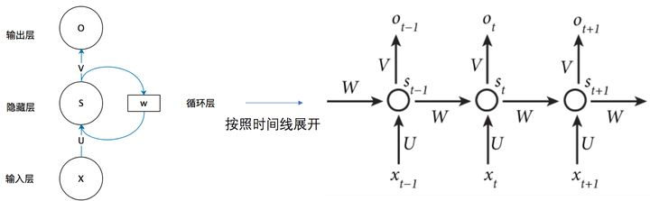
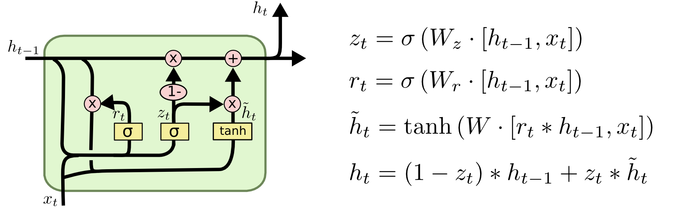

# 数据预处理

## **怎么获取训练样本**

获取高质量的标注数据需要花费昂贵的人力、物力，因此引出很多其他的学习方式，比如半监督、无监督、远程监督、迁移学习等等。

**远程监督（Distant Supervision）算法**，该算法的核心思想是将文本与大规模知识图谱进行实体对齐，利用知识图谱已有的实体间关系对文本进行标注。

远程监督基于的基本假设是：如果从知识图谱中可获取三元组R（E1，E2）（注：R代表关系，E1、E2代表两个实体），且E1和E2共现与句子S中，则S表达了E1和E2间的关系R，标注为训练正例。

该算法很好地解决了数据标注的规模问题，但它基于的基本假设过强，会引入大量噪音数据。训练集会产生大量的 wrong labels，比如两个实体有多种关系或者根本在这句话中没有任何关系，这样的训练数据会对关系抽取器产生影响。

## 数据集不平衡的处理方法

数据不均衡（某一标签数量太多，其余标签数量太少）的问题，在机器学习中被称为**“长尾问题”**。

**（1）扩充数据集**

　　　首先想到能否获得更多数据，尤其是小类（该类样本数据极少）的数据。

**（2）对数据集进行重采样**

　　**a）过采样（over-sampling）：**对小类的数据样本进行过采样来增加小类的数据样本个数。过采样容易发生少样本过拟合，无法学习更鲁棒、易泛化的特征，在不平衡数据上表现较差。为了解决这一问题，可以在每次生成新数据点时加入轻微的随机扰动，经验表明这种做法非常有效，但是这一方式会加重过拟合。

​		**b）欠采样（under-sampling）：**对大类的数据样本进行欠采样来减少大类的数据样本个数，欠采样会造成多样本严重信息损失，导致发生欠拟合。

**（3）人造数据**

　　**a）属性值随机采样**：在该类下所有样本的每个属性特征的取值空间中随机选取一个组成新的样本，即属性值随机采样。此方法多用于小类中的样本，但是该方法可能会产生现实中不存在的样本

​		**b）SMOTE(Synthetic Minority Over-sampling Technique)**

　　　SMOTE是一种过采样算法，它构造新的小类样本而不是产生小类中已有的样本的副本

**（4）改变分类算法**

　　**a）从损失函数的层面考虑**

**重加权** （re-weighting）：使用代价函数时，可以增加小类样本的权值，降低大类样本的权值（这种方法其实是产生了新的数据分布，即产生了新的数据集），从而使得分类器将重点集中在小类样本身上。刚开始，可以设置每个类别的权值与样本个数比例的倒数

　　**b）转化为异常点检测问题**

可以把小类样本作为异常点(outliers)，把问题转化为异常点检测问题(anomaly detection)。此时分类器需要学习到大类的决策分界面，即分类器是一个单个类分类器（One Class Classifier）

​		**c）focal loss**

**（5）迁移学习** （transfer learning）：对多类和少类样本分别建模，将学到的多类样本信息/表示/知识迁移给少类别使用。

**（6）解耦特征和分类器** （decoupling representation & classifier）：研究发现，将特征学习和分类器学习解耦、将不平衡学习分为两个阶段，并在特征学习阶段正常采样、在分类器学习阶段平衡采样，可以带来更好的长尾学习效果。这是目前最优的长尾分类算法。

## 数据增强的实现方法

**简单数据增强(Easy Data Augmentation，EDA)**

**同义词替换(Synonym Replacement, SR)**：从句子中随机选取n个不属于停用词集的单词，并随机选择其同义词替换它们；

**随机插入(Random Insertion, RI)**：随机的找出句中某个不属于停用词集的词，并求出其随机的同义词，将该同义词插入句子的一个随机位置。重复n次；

**随机交换(Random Swap, RS)**：随机的选择句中两个单词并交换它们的位置。重复n次；

**随机删除(Random Deletion, RD)**：以 p pp 的概率，随机的移除句中的每个单词。

**回译**：反向翻译是NLP在机器翻译中经常使用的一个数据增强的方法。。其本质就是快速产生一些不那么准确的翻译结果达到增加数据的目的。回译的方法不仅有类似同义词替换的能力，它还具有在保持原意的前提下增加或移除单词并重新组织句子的能力。

**文档裁剪**：新闻文章通常很长，在查看数据时，对于分类来说并不需要整篇文章。 文章的主要想法通常会重复出现。将文章裁剪为几个子文章来实现数据增强，这样将获得更多的数据。

**生成对抗网络**：GAN是深度学习领域中最令人兴奋的最新进展之一，它们通常用来生成新的图像，但它的一些方法或许也可以适用于文本数据。

**数据增强的作用**

（1）增加训练的数据量，提高模型的泛化能力。

（2）增加噪声数据，提升模型的鲁棒性。

## 重复文本生成怎么解决

定义一个损失函数，**明确地**对“重复”做出惩罚。

模式崩溃。

## 怎么处理没有标签的数据？

远程监督

迁移学习：one-shot zero-shot 

label embedding：将一个label下的样本归纳成一个向量，新的预测样本，encode之后，与这个向量去计算一个score，最后得到该样本的predict label。

# 算法模型

## 传统深度学习

RNN能够更好的处理序列的信，**它能挖掘数据中的时序信息以及语义信息**。

RNN存在什么的问题？RNN一个最大的缺陷就是**梯度消失与梯度爆炸问题**。无论是梯度消失还是梯度爆炸，都是**源于网络结构太深**，造成网络权重不稳定，从本质上来讲是**因为梯度反向传播中的连乘效应。**

**长短期记忆（Long short-term memory, LSTM）是一种特殊的RNN**，主要是为了解决长序列训练过程中的梯度消失和梯度爆炸问题。LSTM主要用来解决RNN（循环神经网络）中存在的长期依赖问题。

1. 输入：h_t-1，x_t，c_t-1
2. 首先h_t-1、x_t 经过遗忘门更新记忆单元c_t-1，决定哪些信息被遗忘
3. 接着h_t-1、x_t 经过输入门决定哪些信息以多大比例被增加到记忆单元中，此时记忆单元更新为c_t
4. 最后h_t-1、x_t 经过输出门，根据当前记忆c_t决定下一时刻的输出h_t
5. 输出：h_t（输出），h_t（隐藏状态），c_t

具有三个门：

1. 遗忘门
2. 输入门
3. 输出门

激活函数函数的作用：LSTM中的三个门是用的sigmoid作为激活函数，生成候选记忆时候用的才是tanh，门j的激活函数如果用relu的话会有个问题，就是relu是没有饱和区域的，那么就没法起到门的作用。这两个激活函数都是**饱和**的。

候选记忆用tanh是因为tanh的输出在-1~1，是0中心的，并且在0附近的梯度大，模型收敛快

优缺点：

方便序列建模，具备长时记忆的能力。

RNN本身的序列依赖结构对于大规模并行计算来说相当的不友好。更长的序列则依然会显得很棘手。

**GRU(Gated Recurrent Unit)是一种LSTM的变形版本**，它将遗忘和输入门组合成一个“更新门”。它还合并了单元状态和隐藏状态。

## word2vec

Word2vec，就是词嵌入（ word embedding) 的一种。

- 如果是用一个词语作为输入，来预测它周围的上下文，那这个模型叫做『Skip-gram 模型』
- 而如果是拿一个词语的上下文作为输入，来预测这个词语本身，则是 『CBOW (Continuous Bag-of-Words) 模型』

为了提高速度，Word2vec 经常采用 2 种加速方式：

1. Negative Sample（负采样）？
2. Hierarchical Softmax ？

优点：

1. 由于 Word2vec 会考虑上下文，跟之前的 Embedding 方法相比，效果要更好（但不如 18 年之后的方法）
2. 比之前的 Embedding方 法维度更少，所以速度更快
3. 通用性很强，可以用在各种 NLP 任务中

缺点：

1. 由于词和向量是一对一的关系，所以多义词的问题无法解决。
2. Word2vec 是一种静态的方式，虽然通用性强，但是无法针对特定任务做动态优化

CBOW比Skip-gram训练速度快，训练过程更加稳定，原因是CBOW使用上下文average的方式进行训练，每个训练step会见到更多样本。而在生僻字（出现频率低的字）处理上，skip-gram比CBOW效果更好，原因是skip-gram不会刻意回避生僻字。

### Skip-gram的实际实现

然而在实际情况中，vocab_size通常很大（几十万甚至几百万），导致W0W_0*W*0和W1W_1*W*1也会非常大。对于W0W_0*W*0而言，所参与的矩阵运算并不是通过一个矩阵乘法实现，而是通过指定ID，对参数W0W_0*W*0进行访存的方式获取。然而对W1W_1*W*1而言，仍要处理一个非常大的矩阵运算（计算过程非常缓慢，需要消耗大量的内存/显存）。为了缓解这个问题，通常采取负采样（negative_sampling）的方式来近似模拟多分类任务。此时新定义的W0W_0*W*0和W1W_1*W*1均为形状为[vocab_size, embedding_size]的张量。

假设有一个中心词cc*c*和一个上下文词正样本tpt_p*t**p*。在Skip-gram的理想实现里，需要最大化使用cc*c*推理tpt_p*t**p*的概率。在使用softmax学习时，需要最大化tpt_p*t**p*的推理概率，同时最小化其他词表中词的推理概率。之所以计算缓慢，是因为需要对词表中的所有词都计算一遍。然而我们还可以使用另一种方法，就是随机从词表中选择几个代表词，通过最小化这几个代表词的概率，去近似最小化整体的预测概率。比如，先指定一个中心词（如“人工”）和一个目标词正样本（如“智能”），再随机在词表中采样几个目标词负样本（如“日本”，“喝茶”等）。有了这些内容，我们的skip-gram模型就变成了一个二分类任务。对于目标词正样本，我们需要最大化它的预测概率；对于目标词负样本，我们需要最小化它的预测概率。通过这种方式，我们就可以完成计算加速。上述做法，我们称之为负采样。

cbow和skip-gram都是在word2vec中用于将文本进行向量表示的实现方法，具体的算法实现细节可以去看word2vec的原理介绍文章。我们这里大体讲下两者的区别，尤其注意在使用当中的不同特点。

在cbow方法中，是用周围词预测中心词，从而利用中心词的预测结果情况，使用GradientDesent方法，不断的去调整周围词的向量。当训练完成之后，每个词都会作为中心词，把周围词的词向量进行了调整，这样也就获得了整个文本里面所有词的词向量。

要注意的是， cbow的对周围词的调整是统一的：求出的gradient的值会同样的作用到每个周围词的词向量当中去。

可以看到，cbow预测行为的次数跟整个文本的词数几乎是相等的（每次预测行为才会进行一次backpropgation, 而往往这也是最耗时的部分），复杂度大概是O(V);

而skip-gram是用中心词来预测周围的词。在skip-gram中，会利用周围的词的预测结果情况，使用GradientDecent来不断的调整中心词的词向量，最终所有的文本遍历完毕之后，也就得到了文本所有词的词向量。

可以看出，skip-gram进行预测的次数是要多于cbow的：因为每个词在作为中心词时，都要使用周围词进行预测一次。这样相当于比cbow的方法多进行了K次（假设K为窗口大小），因此时间的复杂度为O(KV)，训练时间要比cbow要长。

但是在skip-gram当中，每个词都要收到周围的词的影响，每个词在作为中心词的时候，都要进行K次的预测、调整。因此， 当数据量较少，或者词为生僻词出现次数较少时， 这种多次的调整会使得词向量相对的更加准确。因为尽管cbow从另外一个角度来说，某个词也是会受到多次周围词的影响（多次将其包含在内的窗口移动），进行词向量的跳帧，但是他的调整是跟周围的词一起调整的，grad的值会平均分到该词上， 相当于该生僻词没有收到专门的训练，它只是沾了周围词的光而已。

因此，从更通俗的角度来说：

在skip-gram里面，每个词在作为中心词的时候，实际上是 1个学生 VS K个老师，K个老师（周围词）都会对学生（中心词）进行“专业”的训练，这样学生（中心词）的“能力”（向量结果）相对就会扎实（准确）一些，但是这样肯定会使用更长的时间；

cbow是 1个老师 VS K个学生，K个学生（周围词）都会从老师（中心词）那里学习知识，但是老师（中心词）是一视同仁的，教给大家的一样的知识。至于你学到了多少，还要看下一轮（假如还在窗口内），或者以后的某一轮，你还有机会加入老师的课堂当中（再次出现作为周围词），跟着大家一起学习，然后进步一点。因此相对skip-gram，你的业务能力肯定没有人家强，但是对于整个训练营（训练过程）来说，这样肯定效率高，速度更快。

所以，这两者的取舍，要看你自己的需求是什么了。

鉴于skip-gram学习的词向量更细致，但语料库中有大量低频词时，使用skip-gram学习比较合适

word2vec的训练相比bert的情况

word2Vec模型，对于其中的窗口选择策略？窗口选择5，10，15都有什么区别吗？是不是越大越好呢？项目中的一些调参的方法是怎样做得呢？

对golve word2vec 的理解

word2vec 结构中向量提取的位置

word2vec的模型、训练目标

word2vec跟其他预训练模型的区别

word2vec的优化，包括层级softmax的复杂度

word2vec与bert 的区别

word2vec和glove的原理和使用场景，差别

10.word2vector 如何做负采样？是在全局采样？还是在batch采样？如何实现多batch采样？怎么确保采样不会采到正样本？word2vector负采样时为什么要对频率做3/4次方？

11.W2V经过霍夫曼或者负采样之后，模型与原模型相比，是等价的还是相似的？

## Transformer

介绍一下transformer。有什么可以调整的参数。

transformer的并行，encoder decoder的细节结构

transformer多头的意义是什么

transformer没用position embedding 而是position encoding

transformer中的参数共享

介绍一下Transformer.
你认为Transformer同LSTM这些有什么区别和关系?

transformer结构细讲， （感觉把犄角旮旯里都扣了个遍）

transformer结构和bert的结构

了解seq2seq吗?有没有用过对应的transformer进行对应的使用项目?

画一下Transformer结构图

## Attention

多头注意力机制的原理是什么？

8.Transformer用的是哪种attention机制？

具体讲一下self attention。

讲一下attention。

self attention， attention， 双向lstm的区别。

attention和self-attention的公式

attention的公式， 为什么除根号dk

4.Self-attention的Query，Key，Value分别是什么
5.Slef-attention的乘法计算和加法计算有什么区别？什么时候乘比较好，什么时候加？为什么要除以一个根号？

bert中qkv三个向量是否共享，意义

multi-head attention的作用与attention的区别

剪枝的原理，为什么多头attention剪枝有用

attention mask的作用

q、k、v是啥意思（解释了一下）qk可以用别的方法代替吗（可以，只要是计算距离的方法就行，比如说余弦距离）
4.self-attention和attention的区别（说了一堆好像没答道点上，最核心应该是attention只计算q和v）

## Embedding

embedding 的原理和在项目中的具体使用步骤

one-hot与bert embedding 的区别

3个embedding介绍

positional embedding怎么生成的（cos，sin生成的，相当于一个look up tabel）
positional embedding公式

embedding怎么实现？（fasttext or word2vec，不能用BERT，数据量大不合适）补充：你说的是词向量，句子向量怎么做呢（+average pooling最常用，还有别的方法没列举）

embedding中参数的传递和计算

embedding如何学到语音信息，为什么不用拼音来学。

## Bert

layer norm和 batch norm的区别，bert用的是哪个, bert中的norm是对那些输入进行的归一化,和各自的应用场景。已经各自在norm之后还有没有其他操作。训练时候和测试时候的区别。

BERT和其他序列模型区别（BERT不是序列模型，Auto-Encoder的模型，其他比如LSTM是Auto-Regression）

用过bert嘛，时间复杂度是多少？讲一下对self-attention的理解。

说一下BERT和transformer的positional embedding有啥区别

bert中feed forward中参数的传导

bert介绍（跟transformer差不多把，就是多了两个预训练任务

Bert模型的，历史、演变。（RNN、LSTM、ELMo、Attention、Transformer、GPT、BERT、Auto-Encoder、Auto-Regression、Positional Encoder）

Bert为什么效果这么好。

bert中的数据流动，Embedding是怎么做的

BERT模型怎么做的?大致的网络架构是怎么样的?BERT模型对防止梯度消失优化是什么?

word2Vec和BERT的词向量为什么BERT更好?

bert的局限性

还知道哪些bert模型

bert的参数规模，以及大部分参数所处的位置

bert与其他nlp模型的对比和使用情况

Bert，elmo，word2vec等词向量的区别

bert模型结构的具体介绍以及实现

bert自带的词向量库与glove的对比

bert三个embedding的使用方法

roberta和bert的区别

bert结构/ 与训练任务

对不同的bert蒸馏模型的理解
Bert预训练任务有哪些？为什么要这么做？你觉得哪些任务可以如何优化？

bert变种有了解么（介绍了一下roberta和xlnet针对mlm的问题的改进，讲了讲DisliBERT，

bert与roberta的不同

介绍一下BERT的三种的embedding的输入.
transformer的position embedding和BERT的position embedding的区别.

BERT和RNN之类的区别（Auto Encoder与Auto regression，吧啦吧啦 ）
3.BERT的缺点，什么情况无法处理，双重否定，数值可以处理吗（应该不太明感）
4.BERT的输入长度多少？（最大512） 超出怎么办（截断，数据预处理减少无关数据。实在太长直接上LSTM、Transforemer-XL）

LSTM和BERT模型有什么区别?

## 训练相关

BatchSize设定的大小都有什么关系吗？越大的BatchSize就越好吗？

层次softmax为什么? 怎么做的? 从根节点到叶子节点的过程是怎么样的?
导致梯度消失的原因

Batch norm 公式， 与layer norm的区别

# 优化

## Dropout

dropout原理：我们在前向传播的时候，让某个神经元的激活值以一定的概率p停止工作，这样可以使模型泛化性更强，因为它不会太依赖某些局部的特征。

dropout在训练过程和测试过程中参数的设置

## 拟合

什么是过拟合和欠拟合，如何防止

过拟合的表现，原因和如何防止

过拟合的表现和处理方法

降低过拟合的方式（

模型层面降低复杂度

- 模型本身的选择
- 模型的参数个数
- 模型的参数空间选择：正则
- 模型拟合过少的样本

：dropout，正则化等等，数据层面确保测试集训练集分布一致：降噪之类）

过拟合是怎么判断的？

过拟合的解决办法？

为了解决过拟合问题，一般会采用模型集成的方法

------

在训练集上错误率很低，但是在未知数据上错误率很高．这就是所谓的过拟合（Overfitting）．过拟合问题往往是由于训练数据少和噪声以及模型能力强等原因造成的．

为了解决过拟合问题，一般在经验风险最小化的基础上再引入参数的正则化（Regularization）来限制模型能力，使其不要过度地最小化经验风险． 

还可以通过提前停止来防止过拟合。

特征学习在一定程度上也可以减少模型复杂性、缩短训练时间、提高模型泛化能力、避免过

拟合等．

这种准则就是结构风险最小化（Structure Risk Minimization，SRM）准则。

欠拟合（Underfitting），即模型不能很好地拟合训练数据，在训练集上的错误率比较高．欠拟合一般是由于模型能力不足造成的．

我们可以将机器学习看作一个从有限、高维、有噪声的数据上得到更一般性规律的泛化问题。

## 梯度

梯度下降方法有哪些？怎么选择

梯度消失问题怎么解决

梯度消失和梯度爆炸原因分析及解决办法（激活函数，网络层次，正则化

SGD的优点是什么?(对于梯度的要求很低,计算比较快)

## 其他

是否了解一些模型加速和优化的策略？（讲了知识蒸馏）为什么要用大模型训练了再采用小模型进行训练呢，反正不都是需要最后训练大模型么？（也不知道是我不懂还是面试官不懂了,反正我懵了）

模型蒸馏work的原因，具体实现方式

warm up 的的原理作用

动量优化

adam优化

量化、剪枝、参数共享等模型压缩手段

知识蒸馏的应用（同构蒸馏，模型压缩之类）

知识蒸馏的具体过程（从公式开始讲，teacher的soft prediction之类的，还有损失函数的构建）

特征工程是怎么做得？交叉特征是怎么做得的？

提升指标的一些trick 调参之前说过了，就说了加对抗训练，及实现细节

# 激活函数

对激活函数的了解对比，为什么使用激活函数

sigmoid有哪些特性？激活函数了解多少？怎么选择

介绍一下sigmoid 和 relu，relu有什么缺点？

sigmoid当数据太大的时候不敏感怎么办（normalization）

常见的激活函数有哪些。各自有什么特点。分布应用于场景。leaky relu公式。

# 损失函数

loss设计 triplet loss和交叉熵loss各自的优缺点，怎么选择

交叉熵的损失函数是多少，大致是怎么算的。

对交叉熵的介绍和公式

交叉熵的公式

模型蒸馏的损失函数

不同损失函数之间的差异以及取舍问题

# 评估

模型的评估指标

roc坐标含义，auc

比赛对应的评价指标? F1指标是怎么计算的? 了解对应的ROC曲线吗? 怎么计算对应的ROC曲线?

# 其他

偏差、方差指什么？怎么减小

深层神经网络为什么不好训？除了梯度消失还有哪些原因？

实现余弦相似度计算

二叉树有了解吗，遍历有哪些（前中后层次）项目用过哪些数据结构（好像没有，都是用python做的）
动态规划了解吗，解释一下，填表是怎么做的（吧啦吧啦）

GBDT的大概算法

KNN的大概算法

autoencoder原理

tokenize的原理

ml相关模型介绍，原理，项目结果对比， 回归模型数据做归一化的必要性。

介绍一下TextCNN这些模型这样子.

问了GBDT 和 XGBoost和LightGBM的大致改进.

介绍lightgbm。和决策树区别是什么？解决哪种误差？

讲一下线性模型和非线性模型的区别?

还有什么其他比较基础的Nlp技术

模型不收敛原因分析，解决方案（学习率，权重初始化，数据标注，样本不平衡问题等等

LR，SVM，GBDT的原理

- RNN、LSTM、GRU时序模型的特点
- 梯度弥散与梯度爆炸的原因与解决方案
- 激活函数的优缺点
- 什么是L2正则化，为什么L2正则化可以防止过拟合？L1正则化与L2正则化有什么区别和联系。
- XGBoost

1、GBDT , XGBOOST, lightGBM 之间的异同。

2、XGBoost 的参数调优有哪些经验（工程能力）

3、XGBoost 的正则化是如何实现的（工程能力）

4、XGBoost的并行化部分是如何实现的（工程能力

5、Xgboost 优化点

6、决策树节点分裂时如何选择特征，写出Gini index 和Information Gain 的公式并举例

7、分类树和回归树的区别是什么？（理论基础）

8、与Random Forest 作比较，并以此介绍什么是模型的Bias 和Variance（理论基础）

9、xgboost 是用同一个模型吗？

10、谈谈判别式模型和生成式模型？

11、各种聚类算法的优缺点划分：K-means 层次：AGNES 密度：DBSACN 模型：EM

12、Xgboost 优化点、LightGBM 与XGboost 的联系及区别，是都试过了么

13、如果选用一种其他的模型替代XGBoost，你会选用什么？

14、bagging、boosting、stacking 的异同。

15、embedding 的作用是什么？

16、embedding 物理意义?

17、神经网络中的梯度消失和梯度膨胀是什么，怎么解决?

18、激活函数的作用

19、如何检验过拟合，数据量很小怎么办？

20、CRF 的算法的解释。

21、介绍momentum，RMSprop 和Adam 等优化方式

22、word2vec 算法推导

23、word2vec 的优化

24、glove 和word2vec 对比有什么区别？

26、attention 的原理，计算公式。

27、seq2seq 的缺点，如何改进？

28、循环神经网络RNN 怎么解决长期依赖问题？LSTM 的结构是怎样的？

29、怎么理解“长短时记忆单元”？RNN 中的隐状态ht 与LSTM 中的记忆状态Ct 有什么区别？

30、Transformer 原理。手撕

31、Transformer Encoder 与Decoder 有哪些不同？

32、Encoder-Decoder attention 与self-attention

33、Multi-Head attention、多头的理解

34、Position Embedding 位置编码

35、Bert 训练的一些参数？

36、bert 算是去年的工作了，有了解今年有哪些新的技术吗？简单讲讲。

37、BERT 原理。

38、BERT 适合哪些场景，不适合哪些场景。

39、BERT 训练过程中用到涉及到的哪些任务，这些任务如何去实现完成的。

40、如何使用bert？Bert 调参数的心得。

41、在做NER 任务时，lstm 后面可以不用加CRF 吗？

42、BERT 和GPT 的区别

43、如何使用bert？

44、TextRank 原理？

45、聚类方式。K-means，层次聚类，DBSCAN...

46、样本不平衡的解决方法？

47、介绍一下，一些基于BERT 的改进的模型。

48、写下bilstm+crf 的损失函数？损失函数中的max 有什么作用，为什么要减去这个max？具体的emission score 与transition score 是如何得到的？

49、推导LR 的损失函数与梯度下降更新参数（必须要手推一下，当时就没准备好）

50、如何理解过拟合，怎样解决过拟合现象（当时没说全，过拟合现象的原因没有讲清楚）

51、Transformer 在GPT 和Bert 等词向量预训练模型中具体是怎么应用的？有什么变化？

52、NLP 特征抽取机制有哪些？(基于DN), 各有哪些优缺点

53、为什么是缩放点积，而不是点积模型？

54、为什么是双线性点积模型（经过线性变换Q ！=K）？

55、相较于加性模型，点积模型具备哪些优点？

56、用到了什么激活函数，怎么选择激活函数的使用。

57、讲一下高方差和高偏差。

58、下cnn，为什么cnn 中要padding，池化呢。

59、自然语言中如何选择使用cnn 和rnn。

60、因为项目中使用到了macro-f1，所以问了marco-f1，为什么不用Precision、recall?

61、了解python 的深浅拷贝吗？装饰器呢？

62、请简要介绍下SVM

63、请简要介绍下tensorflow 的计算图

64、欧氏距离、曼哈顿距离

65、tf-idf 怎么做的

66、手写一个tfidf

67、读取文件，计算TF-IDF

68、为什么tf-idf char 会对结果有提高？

69、glove 和fasttext 怎么训练的？

70、词向量如何训练的？（word2vector）

71、word2vector 为啥语义相近的词的词向量相近？怎么达到效果的？

72、softmax 和sigmod 区别？