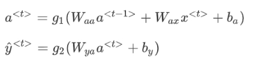

# NLP

# Python基础与数学

## python基础

闭包：一个返回值是函数的函数

## 数学

拉格朗日函数

贝叶斯定理

# 算法

viterbi (维特比) 算法 ：解决多步骤每步多选择模型的最优选择问题。

排序算法

动态规划

# NLP

Pipeline：原始文本->分词->清洗->标准化->特征提取->建模

## 模型

**N-gram模型** 

N-gram模型采用马尔科夫假设。**一个词的出现仅与它之前的若干个词有关**。

一次只考虑一个词称之为 **Unigram**。

如果一个词的出现仅依赖于它前面出现的一个词，那么我们就称之为 **Bi-gram**。

如果一个词的出现仅依赖于它前面出现的两个词，那么我们就称之为 **Tri-gram。**

**N-gram中的数据平滑方法**

N-gram最大的问题就是**稀疏问题（Sparsity）**。

拉普拉斯平滑：

+ Add-one

  

+ Add-K

  

Good-Turning 平滑

**朴素贝叶斯**

朴素贝叶斯法对条件概率分布做了条件独立性的假设。

朴素贝叶斯将句子处理为一个**词袋模型（Bag-of-Words, BoW）**，以至于不考虑每个单词的顺序。

极大似然估计（Maximum Likelihood Estimate，MLE）

最大后验概率估计（Maximum a posteriori estimation, MAP）

## 句子相似度

计算距离

- 欧氏距离
- 余弦相似度

Tf-IDF 算法  参考[TF-IDF与余弦相似度的应用](http://www.ruanyifeng.com/blog/2013/03/cosine_similarity.html)

降低计算相似度时的时间复杂度：倒排表

## 正则化

**L1和L2是正则化项，又叫做罚项，是为了限制模型的参数，防止模型过拟合而加在损失函数后面的一项。**

L1正则：

L1-norm有能产生许多零值或非常小的值的系数的属性，很少有大的系数。

L2正则

正则化项的超参数λ可以通过交叉验证选取。

## **分词方法**

中文分词：

- 前向最大匹配
- 向后最大匹配
- 双向最大匹配

英文分词：

- 英文分词算法(Porter stemmer)

## 评价指标

混淆矩阵

## 超参数搜索方法

**试错法（Babysitting）**：

**网格搜索（Grid search）**：遍历的思路，可行的参数范围都搜一遍。

**随机搜索（Random Search）**：

**贝叶斯优化（Bayesian Optimization）**：

**进化算法优化**：遗传算法

**特征选择**

- **穷举搜索（Exhaustive）**
- **启发式搜索 (Heuristic Search)**：利用当前与问题有关的信息作为启发式信息，这些信息是能够提升查找效率以及减少查找次数的。
  - 序列前向选择( SFS , Sequential Forward Selection )是一种贪心算法
  - 序列后向选择( SBS , Sequential Backward Selection )是一种贪心算法

马尔可夫性:举一个实际例子比如说卖电脑，可能当初你买的电脑花了上万块钱，现在可能只值几百块钱了。我们在卖电脑的时候不会去考虑那个电脑过去值多少钱。而只是考虑当下的价值。再比如说流感病毒的传播，未来感染病毒的人数只依赖于目前感染病毒的人数，而与之前感染病毒的历史人数无关。这种已知“现在”的条件下，过程“将来”的演变与“过去”无关的性质，称之为无后效性或者马尔可夫性。具有无后效性的过程称为马尔科夫过程。

 

隐性马尔可夫:HMM(Hidden Markov Model), 也称隐性马尔可夫模型，是一个概率模型，用来描述一个系统隐性状态的转移和隐性状态的表现概率。

系统的隐性状态指的就是一些外界不便观察(或观察不到)的状态。

隐性状态的表现也就是, 可以观察到的，由隐性状态产生的外在表现特点。

隐马尔可夫模型可以用于标注，这时状态对应着标记，标注问题是给定观测的序列预测其对应的标记序列 。

 

循环时间网络RNN

 

***\*词汇表征（Word Representation）\****

编码网络（***\*encoder network\****）

每次只向该网络中输入一个法语单词，将输入序列接收完毕后，这个***\*RNN\****网络会输出一个向量来代表这个输入序列。

解码网络(decoder network)

它以编码网络的输出作为输入, 之后它可以被训练为每次输出一个翻译后的单词，一直到它输出序列的结尾或者句子结尾标记。

机器翻译：条件语言模型（***\*conditional language model\****）

 

束搜索(***\*Beam Search\****)

贪心搜索(***\*Greedy Search\****)：贪心搜索是一种来自计算机科学的算法，生成第一个词的分布以后，它将会根据你的条件语言模型挑选出最有可能的第一个词进入你的机器翻译模型中，在挑选出第一个词之后它将会继续挑选出最有可能的第二个词，然后继续挑选第三个最有可能的词，这种算法就叫做贪心搜索

集束搜索（***\*beam search\****）：集束搜索算法会有一个参数***\*B\****，叫做集束宽（***\*beam width\****）

 

***\*BLEU\****得分（***\*the BLEU score\****）***\*BLEU\****代表***\*bilingual evaluation understudy\**** (双语评估替补)

 

注意力模型（***\*the Attention Model\****）

注意力权重（***\*a set of attention weights\****）