# 笔记

RNN（或者LSTM，GRU等）的计算限制为是顺序的，也就是说RNN相关算法只能从左向右依次计算或者从右向左依次计算，这种机制带来了两个问题：

1. 时间片 ![[公式]](https://www.zhihu.com/equation?tex=t) 的计算依赖 ![[公式]](https://www.zhihu.com/equation?tex=t-1) 时刻的计算结果，这样限制了模型的并行能力；
2. 顺序计算的过程中信息会丢失，尽管LSTM等门机制的结构一定程度上缓解了长期依赖的问题，但是对于特别长期的依赖现象,LSTM依旧无能为力。

Transformer的提出解决了上面两个问题，首先它使用了Attention机制，将序列中的任意两个位置之间的距离是缩小为一个常量；其次它不是类似RNN的顺序结构，因此具有更好的并行性，符合现有的GPU框架。

### 其他正则化方法（Other regularization methods）：

数据扩增

**early stopping**代表提早停止训练神经网络：**early stopping**的主要缺点就是你不能独立地处理这两个问题，因为提早停止梯度下降，也就是停止了优化代价函数，因为现在你不再尝试降低代价函数，所以代价函数的值可能不够小，同时你又希望不出现过拟合，你没有采取不同的方式来解决这两个问题，而是用一种方法同时解决两个问题，这样做的结果是我要考虑的东西变得更复杂。

如果不用**early stopping**，另一种方法就是正则化，训练神经网络的时间就可能很长。我发现，这导致超级参数搜索空间更容易分解，也更容易搜索，但是缺点在于，你必须尝试很多正则化参数的值，这也导致搜索大量值的计算代价太高。

**Early stopping**的优点是，只运行一次梯度下降，你可以找出的较小值，中间值和较大值，而无需尝试正则化超级参数的很多值。

归一化需要两个步骤：

1. 零均值
2. 归一化方差；

你现在对梯度消失或爆炸问题以及如何为权重初始化合理值已经有了一个直观认识，希望你设置的权重矩阵既不会增长过快，也不会太快下降到0，从而训练出一个权重或梯度不会增长或消失过快的深度网络。我们在训练深度网络时，这也是一个加快训练速度的技巧。

双边误差来判断别人给你的函数，是否正确实现了函数的偏导，现在我们可以使用这个方法来检验反向传播是否得以正确实施

# 统计学中被称为指数加权移动平均值，我们就简称为指数加权平均数

### 动量梯度下降法（Gradient descent with Momentum）

**RMSprop**的算法，全称是**root mean square prop**算法，它也可以加速梯度下降

### Adam 优化算法(Adam optimization algorithm) **Nesterov**

基本上就是将**Momentum**和**RMSprop**结合在一起，那么来看看如何使用**Adam**算法。

### 学习率衰减(Learning rate decay)

### 归一化网络的激活函数  **Batch**归一化

### Batch Norm

**Batch**归一化起的作用的原因，直观的一点就是，它在做类似的工作，但不仅仅对于这里的输入值，还有隐藏单元的值，这只是**Batch**归一化作用的冰山一角，还有些深层的原理，它会有助于你对**Batch**归一化的作用有更深的理解，让我们一起来看看吧。

**Batch**归一化有效的第二个原因是，它可以使权重比你的网络更滞后或更深层，比如，第10层的权重更能经受得住变化，相比于神经网络中前层的权重，

### Softmax 回归（Softmax regression）

查准率（**precision**）和查全率（**recall**）。

查准率的定义是在你的分类器标记为猫的例子中，有多少真的是猫。所以如果分类器有95%的查准率，这意味着你的分类器说这图有猫的时候，有95%的机会真的是猫。

查全率就是，对于所有真猫的图片，你的分类器正确识别出了多少百分比。实际为猫的图片中，有多少被系统识别出来？如果分类器查全率是90%，这意味着对于所有的图像，比如说你的开发集都是真的猫图，分类器准确地分辨出了其中的90%。

结合查准率和查全率的标准方法是所谓的分数，分数的细节并不重要。但非正式的，你可以认为这是查准率和查全率的平均值。

这个函数叫做查准率和查全率的调和平均数

开发集和测试集为什么必须来自同一分布

现在流行的是把大量数据分到训练集，然后少量数据分到开发集和测试集，特别是当你有一个非常大的数据集时。

端到端学习到底是什么呢？简而言之，以前有一些数据处理系统或者学习系统，它们需要多个阶段的处理。那么端到端深度学习就是忽略所有这些不同的阶段，用单个神经网络代替它。

词嵌入还有一个迷人的特性就是它还能帮助实现类比推理

**Word2Vec**

 **Skip-Gram**

**CBOW**是从原始语句推测目标字词；而**Skip-Gram**正好相反，是从目标字词推测出原始语句。**CBOW**对小型数据库比较合适，而**Skip-Gram**在大型语料中表现更好。

**Skip-Gram**模型，关键问题在于**softmax**这个步骤的计算成本非常昂贵，因为它需要在分母里对词汇表中所有词求和。通常情况下，**Skip-Gram**模型用到更多点。

那么如何选取k？**Mikolov**等人推荐小数据集的话，k从5到20比较好。如果你的数据集很大，就选的小一点。对于更大的数据集就等于2到5，数据集越小就越大。那么在这个例子中，我们就用k=4。

### GloVe 词向量（GloVe Word Vectors）

现在机器学习和人工智能算法正渐渐地被信任用以辅助或是制定极其重要的决策，因此我们想尽可能地确保它们不受非预期形式偏见影响，比如说性别歧视、种族歧视等等。本节视频中我会向你展示词嵌入中一些有关减少或是消除这些形式的偏见的办法。

束搜索(**Beam Search**) 长度归一化（**Length normalization**）

****

贪心搜索(**Greedy Search**)

### 注意力模型

单变量线性回归(Linear Regression with One Variable)

假设函数

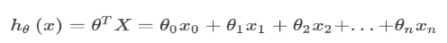 

平方误差函数

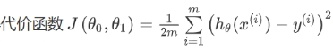 

梯度下降算法

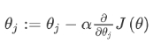 

***\*批量梯度下降：\****指的是在梯度下降的每一步中，我们都用到了所有的训练样本，在梯度下降中，在计算微分求导项时，我们需要进行求和运算，所以，在每一个单独的梯度下降中，我们最终都要计算这样一个东西，这个项需要对所有训练样本求和（m个样本）。

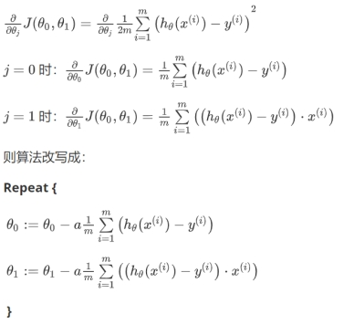 

多变量线性回归(Linear Regression with Multiple Variables)

代价函数

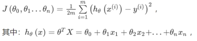 

梯度下降

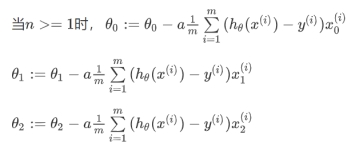 

逻辑回归(Logistic Regression)

***\*S\****形函数（***\*Sigmoid function\****）

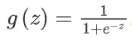 

假设函数

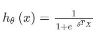 

重新定义逻辑回归的代价函数为：

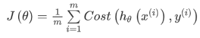 

其中

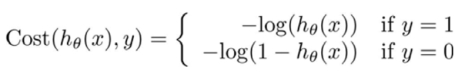 

简化如下

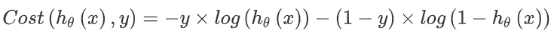 

带入代价函数得到

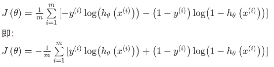 

梯度下降

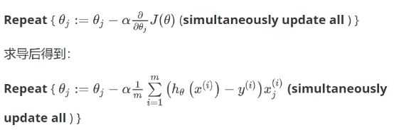 

 

过拟合

正则化

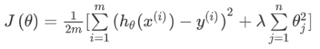 

其中λ又称为正则化参数（***\*Regularization Parameter\****）

 

神经网络

梯度检验（***\*Numerical Gradient Checking\****）

代价函数上沿着切线的方向选择离两个非常近的点然后计算两个点的平均值用以估计梯度。即对于某个特定的 ，我们计算出在 哦θ-ε 处和θ+ε 的代价值（是一个非常小的值，通常选取 0.001），然后求两个代价的平均，用以估计在θ处的代价值。

只针对θ1进行检验的示例：

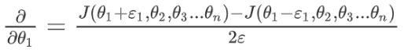 

 

训练神经网络：

\1. 参数的随机初始化

\2. 利用正向传播方法计算所有的hθ(x)

\3. 编写计算代价函数J的代码

\4. 利用反向传播方法计算所有偏导数

\5. 利用数值检验方法检验这些偏导数

\6. 使用优化算法来最小化代价函数

 

当我们运用训练好了的模型来预测未知数据的时候发现有较大的误差，我们下一步可以做什么？

\1. 获得更多的训练样本——通常是有效的，但代价较大，下面的方法也可能有效，可考虑先采用下面的几种方法。

\2. 尝试减少特征的数量λ

\3. 尝试获得更多的特征λ

\4. 尝试增加多项式特征

\5. 尝试减少正则化程度

\6. 尝试增加正则化程度

 

 

***\*评估假设\****

\1. 对于线性回归模型，我们利用测试集数据计算代价函数J

\2. 对于逻辑回归模型，我们除了可以利用测试数据集来计算代价函数外：

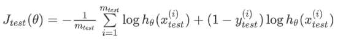 

误分类的比率，对于每一个测试集样本，计算：

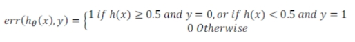 

 

### ***\*学习曲线\****

学习曲线是学习算法的一个很好的***\*合理检验\****（***\*sanity check\****）。学习曲线是将训练集误差和交叉验证集误差作为训练集样本数量（m）的函数绘制的图表。 即，如果我们有100行数据，我们从1行数据开始，逐渐学习更多行的数据。思想是：当训练较少行数据的时候，训练的模型将能够非常完美地适应较少的训练数据，但是训练出来的模型却不能很好地适应交叉验证集数据或测试集数据。

 

### ***\*误差度量\****

***\*精确率\****（***\*Precision\****）和***\*召回率\****（***\*Recall\****）

1.正确肯定（True Positive,TP）：预测为真，实际为真

2.正确否定（True Negative,TN）：预测为假，实际为假

3.错误肯定（False Positive,FP）：预测为真，实际为假 

4.错误否定（False Negative,FN）：预测为假，实际为真

***\*精确率\****（***\*Precision\****）=***\*TP/(TP+FP)\****。

***\*召回率\****（***\*Recall\****）=***\*TP/(TP+FN)\****

***\*F1 值\****（***\*F1 Score\****）***\*=2PR/P+R\****

 

***\*支持向量机(Support Vector Machines)\****

 

归一化输入（Normalizing inputs）

梯度消失

梯度爆炸

梯度检验

### ***\*Mini-batch 梯度下降（Mini-batch gradient descent）\****

假设***\*mini-batch\****大小为1，就有了新的算法，叫做随机梯度下降法，缺点是，你会失去所有向量化带给你的加速，因为一次性只处理了一个训练样本，这样效率过于低下。

优化算法

### ***\*指数加权平均数（Exponentially weighted averages）\****

### ***\*学习率衰减(Learning rate decay)\****

### ***\*Softmax 回归（Softmax regression）\****

 